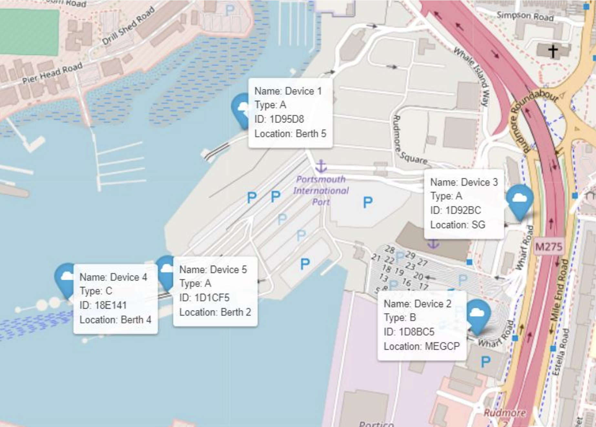

# Combined Data for Modelling

The complete dataset that has been used to develop the machine learning model for CO2 prediction. Created by pulling together information from all the other datasets.

## File explainer

1. **GRT**: The sum of the gross tonnage of the ships, i.e., it is the total gross tonnage of all the ships present at Portsmouth Port during the timestamp (Linkspan 1, Linkspan 2, etc.).
2. **ship_loa**: The sum of every ship’s length present at port (Linkspan 1, Linkspan 2, etc.).
3. **power**: The sum of every ship’s power present at port (Linkspan 1, Linkspan 2, etc.).
4. **wdir**: the average wind direction in degrees (°)
5. **wspd**: The average wind speed in km/h
6. **Sensor_Temp**: The average temperature detected by the B4T sensor at port during timestamp.
7. **Sensor_Humidity**: The average Humidity detected by the B4T sensor at port during timestamp.
8. **Vehicle**: The total number of vehicles at M275 during the timestamp
   CO2 Data:
9. **CO2_1D1CF5**: The CO2 data detected by the B4T sensor at the port during the timestamp. The exact sensor location is available on the device location map.
10. **CO2_1D8BC5**: The CO2 data detected by the B4T sensor at the port during the timestamp. The exact sensor location is available on the device location map.
11. **CO2_1D95D8**: The CO2 data detected by the B4T sensor at the port during the timestamp. The exact sensor location is available on the device location map.
12. **CO2_18E141**: The CO2 data detected by the B4T sensor at the port during the timestamp. The exact sensor location is available on the device location map.
13. **avg_CO2**: The average of all the above sensor data at port during timestamp.

